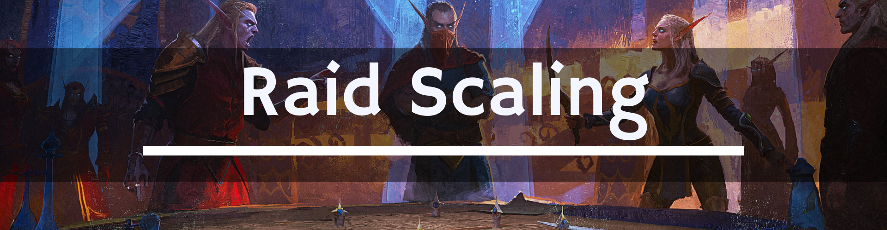

# ⚖️ **[T-Guides] Raid Scaling**

> 💡 На сервере Turtle WoW действует динамическая система скалирования сложности рейдов. Здоровье и урон противников автоматически уменьшаются в зависимости от фактического числа игроков в рейде. Это позволяет проходить контент меньшим составом.

---

## 📊 Таблица скалирования

| Рейд | Стандартный размер | Минимальный размер для скалирования |
| :--- | :--- | :--- |
| **[Onyxia Lair (Ony)](../RAIDS/Onyxia.md)** | 40 человек | 20 человек |
| **[Molten Core (MC)](../RAIDS/MoltenCore.md)** | 40 человек | 20 человек |
| **Blackwing Lair (BWL)** | 40 человек | 20 человек |
| **The Temple of Ahn'Qiraj (AQ40)** | 40 человек | 20 человек |
| **Zul'Gurub (ZG)** | 20 человек | 12 человек |
| **Ruins of Ahn'qiraj (AQ20)** | 20 человек | 12 человек |
| **Naxxramas (Naxx)** | 40 человек | 30 человек |
| **Emerald Sanctum (ES)** | 40 человек | 30 человек |
| **Tower of Karazhan (TK)** | 40 человек | 35 человек |

---

## 🔗 Содержание

- [Главная страница](..) 
- [Полное содержание](../README.md)

---

### ✍️ **Участие и обратная связь**

Если ты заметил **ошибку**, неточность в описании или можешь что-то улучшить - не стесняйся! Смело создай **Issue**: [https://github.com/whtmst/T-Guides/issues](https://github.com/whtmst/T-Guides/issues).

---

## 📄 Лицензия

Лицензия [GPL-3.0 license](../LICENSE) - не стесняйтесь использовать эти данные в своих проектах!

---

## 👥 Автор

**Создано и/или поддерживается пользователем**: [Wht Mst](https://github.com/whtmst)

*Сделано с ❤️ для сообщества Turtle WoW*

*Этот проект не связан (или не аффилирован) с Turtle WoW или Blizzard Entertainment.*