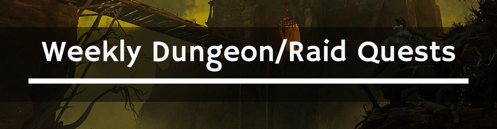

# 📜 **[T-Guides] Weekly Dungeon/Raid Quests**

**Weekly Dungeon/Raid Quests** - это специальные еженедельные задания, которые мотивируют игроков посещать подземелья и рейды. Суть проста: убиваем определенных боссов, получаем квестовые предметы и обмениваем их на ценные сундуки с наградами.

---

## 📍 **Где брать задания?**

Задания можно получить в главных столицах вашей фракции у специальных NPC:

| Фракция | NPC | Изображение |
| :--- | :--- | :---: |
| 👹 **Орда** | **[Overlord Runthak](https://database.turtle-wow.org/?npc=14392)** (Orgrimmar) |  |
| 🦁 **Альянс** | **[Justine Demalier](https://database.turtle-wow.org/?npc=12481)** (Stormwind City) |  |
---

## ⚔️ **Задания и боссы**

Ниже приведен список заданий **Call to Arms** и боссов, с которых падают необходимые квестовые предметы.

### 🛡️ **1. Call to Arms: Dungeon Delving**

Это задание отправляет вас в классические подземелья 55-60 уровней.
**Награда:** **[War Supplies Cache](https://database.turtle-wow.org/?item=41986)**

* **Blackrock Depths (BRD):**
    * Emperor Dagran Thaurissan
    * Ambassador Flamelash
* **Dire Maul (DM):**
    * **East:** Alzzin the Wildshaper, Illyanna Ravenoak
    * **West:** Prince Tortheldrin, Tendris Warpwood, Immol'thar, Magister Kalendris
    * **North:** King Gordok, Cho'Rush the Observer, Guard Mol'dar, Stomper Kreeg, Guard Fengus, Guard Slip'kik, Captain Kromcrush
* **Stratholme:**
    * **Live:** Grand Crusader Dathrohan, Balnazzar, Cannon Master Willey, Skul, Hearthsinger Forresten, Archivist Galford, Malor the Zealous
    * **Undead:** Baron Rivendare, Stonespine, Baroness Anastari, Nerub'enkan, Maleki the Pallid, Magistrate Barthilas

### 🔥 **2. Call to Arms: Molten Assault**

Задание для рейдеров, посещающих Огненные Недра.
**Награда:** **[Molten Supplies Cache](https://database.turtle-wow.org/?item=41990)**

* **Molten Core (MC):**
    * Sorcerer-Thane Thaurissan
    * Incindis

### 🔮 **3. Call to Arms: Cleansing the Corruption**

Задание связано с кастомным рейдом Lower Karazhan Halls.
**Награда:** **[War Supplies Cache](https://database.turtle-wow.org/?item=41986)**

* **Lower Karazhan Halls (LKH):**
    * Moroes
    * Clawlord Howlfang
    * Lord Blackwald II
    * Grizikil
    * Brood Queen Araxxna

---

## 🎁 **Награды: Содержимое сундуков**

Ниже представлены таблицы с возможным лутом из сундуков, отсортированные по шансу выпадения.

### 📦 **War Supplies Cache**

Этот сундук содержит широкий спектр расходников, реагентов для профессий и даже редких маунтов.

| Предмет | Шанс | Тип |
| :--- | :--- | :--- |
| **[Elemental Sharpening Stone](https://database.turtle-wow.org/?item=18262)** | 24% | Заточка |
| **[Brilliant Mana Oil](https://database.turtle-wow.org/?item=20748)** | 24% | Масло |
| **[Brilliant Wizard Oil](https://database.turtle-wow.org/?item=20749)** | 24% | Масло |
| **[Bright Dream Shard](https://database.turtle-wow.org/?item=61199)** | 24% | Реагент |
| **[Major Mana Potion](https://database.turtle-wow.org/?item=13444)** | 20% | Зелье |
| **[Major Healing Potion](https://database.turtle-wow.org/?item=13446)** | 20% | Зелье |
| **[Truesilver Ore](https://database.turtle-wow.org/?item=7911)** | 20% | Руда |
| **[Thorium Ore](https://database.turtle-wow.org/?item=10620)** | 20% | Руда |
| **[Dark Iron Ore](https://database.turtle-wow.org/?item=11370)** | 20% | Руда |
| **[Azerothian Diamond](https://database.turtle-wow.org/?item=12800)** | 20% | Камень |
| **[Illusion Dust](https://database.turtle-wow.org/?item=16204)** | 16% | Инчант |
| **[Gromsblood](https://database.turtle-wow.org/?item=8846)** | 15% | Трава |
| **[Dreamfoil](https://database.turtle-wow.org/?item=13463)** | 15% | Трава |
| **[Golden Sansam](https://database.turtle-wow.org/?item=13464)** | 15% | Трава |
| **[Mountain Silversage](https://database.turtle-wow.org/?item=13465)** | 15% | Трава |
| **[Plaguebloom](https://database.turtle-wow.org/?item=13466)** | 15% | Трава |
| **[Icecap](https://database.turtle-wow.org/?item=13467)** | 15% | Трава |
| **[Firebloom](https://database.turtle-wow.org/?item=4625)** | 12% | Трава |
| **[Wildvine](https://database.turtle-wow.org/?item=8153)** | 12% | Трава |
| **[Arthas' Tears](https://database.turtle-wow.org/?item=8836)** | 12% | Трава |
| **[Sungrass](https://database.turtle-wow.org/?item=8838)** | 12% | Трава |
| **[Blindweed](https://database.turtle-wow.org/?item=8839)** | 12% | Трава |
| **[Ghost Mushroom](https://database.turtle-wow.org/?item=8845)** | 12% | Трава |
| **[Fadeleaf](https://database.turtle-wow.org/?item=3818)** | 10% | Трава |
| **[Wintersbite](https://database.turtle-wow.org/?item=3819)** | 10% | Трава |
| **[Limited Invulnerability Potion](https://database.turtle-wow.org/?item=3387)** | 10% | Зелье |
| **[Free Action Potion](https://database.turtle-wow.org/?item=5634)** | 10% | Зелье |
| **[Elixir of Superior Defense](https://database.turtle-wow.org/?item=13445)** | 10% | Эликсир |
| **[Elixir of the Mongoose](https://database.turtle-wow.org/?item=13452)** | 10% | Эликсир |
| **[Mageblood Potion](https://database.turtle-wow.org/?item=20007)** | 10% | Зелье |
| **[Dreamshard Elixir](https://database.turtle-wow.org/?item=61224)** | 10% | Эликсир |
| **[Core of Earth](https://database.turtle-wow.org/?item=7075)** | 10% | Элементаль |
| **[Arcane Crystal](https://database.turtle-wow.org/?item=12363)** | 10% | Камень |
| **[Essence of Earth](https://database.turtle-wow.org/?item=7076)** | 10% | Эссенция |
| **[Essence of Fire](https://database.turtle-wow.org/?item=7078)** | 10% | Эссенция |
| **[Essence of Water](https://database.turtle-wow.org/?item=7080)** | 10% | Эссенция |
| **[Essence of Air](https://database.turtle-wow.org/?item=7082)** | 10% | Эссенция |
| **[Living Essence](https://database.turtle-wow.org/?item=12803)** | 10% | Эссенция |
| **[Large Brilliant Shard](https://database.turtle-wow.org/?item=14344)** | 10% | Инчант |
| **[Greater Eternal Essence](https://database.turtle-wow.org/?item=16203)** | 10% | Инчант |
| **[Arcane Essence](https://database.turtle-wow.org/?item=61673)** | 10% | Инчант |
| **[Purple Lotus](https://database.turtle-wow.org/?item=8831)** | 6% | Трава |
| **[Grave Moss](https://database.turtle-wow.org/?item=3369)** | 4% | Трава |
| **[Black Lotus](https://database.turtle-wow.org/?item=13468)** | 4% | Трава (Редкая) |
| **[Rumsey Rum Black Label](https://database.turtle-wow.org/?item=21151)** | 4% | Алкоголь |
| **[Flask of the Titans](https://database.turtle-wow.org/?item=13510)** | 3% | Фласка |
| **[Flask of Distilled Wisdom](https://database.turtle-wow.org/?item=13511)** | 3% | Фласка |
| **[Flask of Supreme Power](https://database.turtle-wow.org/?item=13512)** | 3% | Фласка |
| **[Flask of Petrification](https://database.turtle-wow.org/?item=13506)** | 1% | Фласка |
| **[Tawny Leopard](https://database.turtle-wow.org/?item=12326)** | 0.2% | Маунт |
| **[Golden Leopard](https://database.turtle-wow.org/?item=12327)** | 0.2% | Маунт |
| **[Red Feral Raptor](https://database.turtle-wow.org/?item=23803)** | 0.2% | Маунт |
| **[Brown Tallstrider](https://database.turtle-wow.org/?item=50072)** | 0.2% | Маунт |
| **[Gray Tallstrider](https://database.turtle-wow.org/?item=50073)** | 0.2% | Маунт |
| **[Spirit Worg](https://database.turtle-wow.org/?item=80480)** | 0.1% | Маунт |
| **[Cloudwing Hippogryph](https://database.turtle-wow.org/?item=81242)** | 0.1% | Маунт |

### 🌋 **Molten Supplies Cache**

Сундук с ценными ресурсами из Огненных Недр, полезными для крафта экипировки с сопротивлением огню и высокоуровневой химии.

| Предмет | Шанс | Тип |
| :--- | :--- | :--- |
| **[Firebloom](https://database.turtle-wow.org/?item=4625)** | 24% | Трава |
| **[Elemental Fire](https://database.turtle-wow.org/?item=7068)** | 24% | Элементаль |
| **[Fiery Core](https://database.turtle-wow.org/?item=17010)** | 24% | Реагент из Molten Core |
| **[Core Leather](https://database.turtle-wow.org/?item=17012)** | 24% | Реагент из Molten Core |
| **[Essence of Earth](https://database.turtle-wow.org/?item=7076)** | 24% | Эссенция |
| **[Heart of Fire](https://database.turtle-wow.org/?item=7077)** | 24% | Эссенция |
| **[Essence of Fire](https://database.turtle-wow.org/?item=7078)** | 24% | Эссенция |
| **[Lava Core](https://database.turtle-wow.org/?item=17011)** | 24% | Реагент Molten Core |
| **[Major Mana Potion](https://database.turtle-wow.org/?item=13444)** | 24% | Зелье |
| **[Major Healing Potion](https://database.turtle-wow.org/?item=13446)** | 24% | Зелье |
| **[Greater Fire Protection Potion](https://database.turtle-wow.org/?item=13457)** | 24% | Зелье (ГФПП) |
| **[Elixir of Greater Firepower](https://database.turtle-wow.org/?item=21546)** | 24% | Эликсир |
| **[Dragonbreath Chili](https://database.turtle-wow.org/?item=12217)** | 4% | Еда |
| **[Blood of the Mountain](https://database.turtle-wow.org/?item=11382)** | 4% | Реагент Molten Core |
| **[Flask of Supreme Power](https://database.turtle-wow.org/?item=13512)** | 4% | Фласка |
| **[Dark Iron Scorpid](https://database.turtle-wow.org/?item=30022)** | 0.2% | Маунт |

---

## 🤝 **Благодарность**

> Отдельное спасибо за идею согильдийцу **Freezz** (паладин из гильдии **[ONLINE](https://discord.gg/6jHMsP5ZvM)**).

---

## 🔗 Содержание

- [Главная страница](..) 
- [Полное содержание](../README.md)

---

### ✍️ **Участие и обратная связь**

Если ты заметил **ошибку**, неточность в описании или можешь что-то улучшить - не стесняйся! Смело создай **Issue**: [https://github.com/whtmst/T-Guides/issues](https://github.com/whtmst/T-Guides/issues).

---

## 📄 Лицензия

Лицензия [GPL-3.0 license](../LICENSE) - не стесняйтесь использовать эти данные в своих проектах!

---

## 👥 Автор

**Создано и/или поддерживается пользователем**: [Wht Mst](https://github.com/whtmst)

*Сделано с ❤️ для сообщества Turtle WoW*

*Этот проект не связан (или не аффилирован) с Turtle WoW или Blizzard Entertainment.*