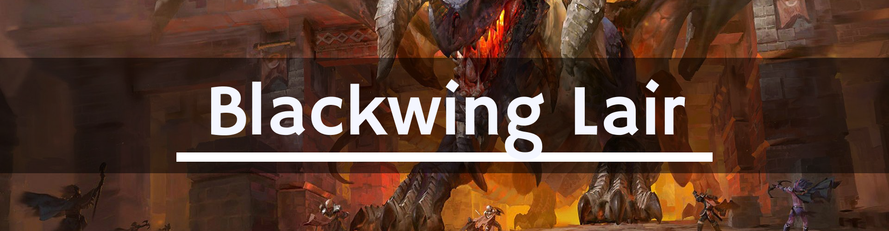

# 🐲 **[Turtle WoW] Blackwing Lair**

**Blackwing Lair (BWL)** - легендарный рейд на 40 человек (с возможностью скалирования до 20), являющийся домом Нефариана, расположенный на вершине Blackrock Spire.

## 🧪 **Расходники**

* **[Onyxia Scale Cloak](https://database.turtle-wow.org/?item=15138)**: **ОБЯЗАТЕЛЕН** для всех танков. Для остальных классов - критически важен на **Nefarian**, **Firemaw**, **Ebonroc**, **Flamegor** для выживания при **Shadow Flame**.
* **[Hourglass Sand](https://database.turtle-wow.org/?item=19183)**: Падает с трэша. Необходим для снятия **Bronze Affliction** на **Chromaggus**.
* **[Greater Fire Protection Potion (ГФПП)](https://database.turtle-wow.org/?item=13457)**: Нужно много. Основной расходник на **Vaelastrasz**, **Firemaw** и **Nefarian**.
* **[Restorative Potion](https://database.turtle-wow.org/?item=9030)**: Крайне полезен на **Chromaggus** для снятия ядов/болезней/проклятий.
* **[Flask of the Titans](https://database.turtle-wow.org/?item=13510)**: Обязательно для танков.
* **[Stratholme Holy Water](https://database.turtle-wow.org/?item=13180)**: Очень полезна на 3-й фазе **Nefarian**.
* Вся остальная **минимальная химия** пьется по умолчанию. Список можно посмотреть **[здесь](https://docs.google.com/spreadsheets/d/1F4txPb-2qzuf0FMHRqRDPYN3_nVGPMNQDlKYYwzOBDA/edit?gid=0#gid=0)**.
* Наличие боссмода **[BigWigs](https://github.com/pepopo978/BigWigs)** обязательно для каждого уважающего себя рейдера.
* Удобный аддон для снятия ядов, проклятий и остальных дебаффов - **[Rinse](https://github.com/Otari98/Rinse)**.

---

## 🥚 **1. Razorgore the Untamed**

Бой состоит из двух фаз: уничтожение яиц и убийство босса.

### **Фаза 1: Уничтожение яиц**

* **Grethok the Controller** и его охрана должны быть убиты немедленно.
* Назначенный игрок использует **Orb of Domination** для контроля босса.
* **Контроллер:** Использует способность **[Destroy Egg](https://database.turtle-wow.org/?spell=19873)** (КД 7 сек) по кулдауну. Также может использовать **Calm Dragonkin** для усыпления мобов.
* **Рейд:**
    * Кайтит и убивает появляющийся трэш.
    * **Маги** и **Чернокнижники** должны убивать/контролить **Blackwing Mage** в первую очередь.
    * **Охотники** и **Войны** кайтят **Legionnaires** и **Dragonspawn** (используйте **Piercing Howl** и ловушки).

### **Фаза 2: Razorgore**

Как только последнее (30-е) яйцо уничтожено, весь трэш убегает, и начинается бой с боссом.

* **Способности:**
    * **[Fireball Volley](https://database.turtle-wow.org/?spell=22425)**: АОЕ урон огнем. Можно лосать (LoS), но чаще просто отхиливают.
    * **[Conflagration](https://database.turtle-wow.org/?spell=23023)**: Поджигает цель (обычно танка), нанося урон и дезориентируя на 10 сек.
    * **[War Stomp](https://database.turtle-wow.org/?spell=24375)**: Стан по области вокруг босса.

* **Тактика:**
    1.  МТ забирает босса. ОТ должен быть готов перехватить, если МТ получит **Conflagration**.
    2.  Рейд стоит рассредоточенно, хилы держат танков.

---

## 🩸 **2. Vaelastrasz the Corrupt**

ДПС чек босс. Бой начинается с диалога (не баффайтесь, пока МТ не поговорит). У вас есть 3 минуты, прежде чем рейд умрет.

* **Способности:**
    * **[Essence of the Red](https://database.turtle-wow.org/?spell=23513)**: Бафф на весь рейд. Дает бесконечную ману, ярость и энергию на 3 минуты.
    * **[Burning Adrenaline](https://database.turtle-wow.org/?spell=18173)**: Кидается на мана-юзеров (раз в 15 сек) и на текущего Танка (раз в 45 сек). Увеличивает урон на 100%, делает спеллы мгновенными, но убивает игрока, взрывая его в конце.
    * **[Flame Breath](https://database.turtle-wow.org/?spell=23461)**: Фронтальное дыхание.
    * **[Fire Nova](https://database.turtle-wow.org/?spell=23462)**: Постоянный АОЕ урон по всему рейду.
    * **Tail Swipe (Удар хвостом):** Отбрасывает игроков, стоящих сзади.

* **Тактика:**
    1.  **Танк-ротация:** МТ получает **Burning Adrenaline** через 45 сек и умирает. Следующий танк должен быть готов мгновенно забрать босса.
    2.  **Burning Adrenaline:** Если вы получили этот дебафф - **немедленно бегите в специально отведенное место** (подальше от рейда), наносите урон/хильте, пока не умрете. Взрыв наносит урон союзникам!
    3.  **ДПС:** Максимальный урон. Роги и Вары, следите за аггро - у танков оно ограничено их скорой смертью.
    4.  **Хилы:** Спамьте групповой хил (**Chain Heal**, **Prayer of Healing**).

---

## 🚧 **3. Broodlord Lashlayer**

Перед боссом находится **Suppression Room**. Роги должны быть в стелсе и обезвреживать ловушки (**Suppression Devices**), которые сильно замедляют рейд. Двигайтесь плотной группой.

* **Способности:**
    * **[Mortal Strike](https://database.turtle-wow.org/?spell=24573)**: Мощный удар по танку + дебафф на -50% хила.
    * **[Blast Wave](https://database.turtle-wow.org/?spell=23331)**: АОЕ урон огнем + замедление.
    * **[Knock Away](https://database.turtle-wow.org/?spell=18670)**: Отбрасывает текущую цель и **снижает аггро на 50%**.

* **Тактика:**
    1.  Танчить босса в углу у ворот **спиной к стене**, чтобы танк не улетал.
    2.  **Смена танков:** После каждого **Knock Away** аггро МТ падает. ОТ должен быть вторым по аггро и сразу забрать босса.
    3.  Хилы должны вешать щиты (**Power Word: Shield**) на танка перед **Mortal Strike**.

---

## 🔥 **4. Firemaw**

* **Способности:**
    * **[Flame Buffet](https://database.turtle-wow.org/?spell=23341)**: Стакающийся дебафф, увеличивает урон от огня. Вешается на всех в зоне видимости (LoS) босса.
    * **[Wing Buffet](https://database.turtle-wow.org/?spell=23339)**: Фронтальное отбрасывание и снижение аггро.
    * **[Shadow Flame](https://database.turtle-wow.org/?spell=22539)**: Ваншот конус (нужен **Onyxia Scale Cloak**).

* **Тактика:**
    1.  Танчить в дверном проеме. Рейд стоит за углом.
    2.  **Сброс стаков:** Весь рейд (и танки) должны периодически прятаться за угол (LoS), чтобы сбросить стаки **Flame Buffet** (обычно на 5-7 стаках).
    3.  **Смена танков:** МТ ловит **Wing Buffet** (теряет аггро), ОТ забирает босса, МТ уходит сбрасывать стаки.

---

## 🌑 **5. Ebonroc**

* **Способности:**
    * **[Shadow of Ebonroc](https://database.turtle-wow.org/?spell=23340)**: Дебафф на цель (8 сек). Если босс бьет цель с этим дебаффом, он **хилится** по 25,000 за удар.
    * **[Wing Buffet](https://database.turtle-wow.org/?spell=23339)**: Отбрасывание и снижение аггро.
    * **[Shadow Flame](https://database.turtle-wow.org/?spell=22539)**: Ваншот конус (нужен **Onyxia Scale Cloak**).

* **Тактика:**
    1.  Танчить спиной к стене.
    2.  **Смена танков:** Как только МТ получает дебафф **Shadow of Ebonroc**, второй танк должен **МГНОВЕННО** забрать босса **Taunt** (Провокация). Босс не должен ударить проклятую цель ни разу.

---

## 🤬 **6. Flamegor**

* **Способности:**
    * **[Frenzy](https://database.turtle-wow.org/?spell=28371)**: Увеличивает скорость атаки и начинает спамить **Fire Nova**.
    * **[Wing Buffet](https://database.turtle-wow.org/?spell=23339)**: Отбрасывание.
    * **[Shadow Flame](https://database.turtle-wow.org/?spell=22539)**: Ваншот конус (нужен **Onyxia Scale Cloak**).

* **Тактика:**
    1.  Танчить спиной к стене.
    2.  **Охотники:** Обязаны мгновенно снимать **Frenzy** способностью **[Tranquilizing Shot](https://database.turtle-wow.org/?spell=19801)**. Если опоздать - рейд получит огромный урон от огня.

---

## 🐶 **7. Chromaggus**

* **Breaths (Дыхания):** Босс использует 2 из 5 дыханий (меняются каждую неделю). **BigWigs** предупредит о касте.
    * **[Time Lapse](https://database.turtle-wow.org/?spell=23310)** (Bronze): Стан + снижение ХП + сброс аггро. **Самое опасное**.
    * **[Incinerate](https://database.turtle-wow.org/?spell=23308)** (Red): Урон огнем.
    * **[Corrosive Acid](https://database.turtle-wow.org/?spell=23313)** (Green): Урон природой + минус броня.
    * **[Frost Burn](https://database.turtle-wow.org/?spell=23187)** (Blue): Урон льдом + замедление атаки.
    * **[Ignite Flesh](https://database.turtle-wow.org/?spell=23315)** (Black): Дота огнем (стакается).

* **Дебаффы:** Вешает на рейд болезни, яды, проклятия, магию.
    * **ВАЖНО:** Если на игроке соберутся все 5 типов дебаффов - он превратится в мутанта (Drakonid) и начнет убивать своих.
    * **Приоритет диспелов:** Все виды дебаффов должны сниматься нон-стоп.
    * **Time Lapse (Bronze):** Снимается только песком **[Hourglass Sand](https://database.turtle-wow.org/?item=19183)**.

* **Тактика:**
    1.  Весь рейд прячется (LoS) от дыханий за углом.
    2.  Если активно **Time Lapse** - ОТ должны "ловить" дыхание, чтобы босс переагривался на них, пока МТ в стане.
    3.  На 20% босс впадает в **Enrage** (бьет сильно). Ханты снимают **Frenzy** способностью **[Tranquilizing Shot](https://database.turtle-wow.org/?spell=19801)**.
    4.  Следите за уязвимостью босса, чтобы наносить повышенный урон нужной школой магии. **BigWigs** сообщит *"Current Vulnerability - "* когда босс использует эмоцию *"Chromaggus flinches as its skin shimmers"*.

---

## 👑 **8. Nefarian**

Финальный босс. **Onyxia Scale Cloak** обязателен для всего рейда.

### **Фаза 1: Drakonids**
Из двух дверей выходят дракониды разных цветов (цвета меняются каждую неделю).
* **Red (Красные):** Огненный АОЕ урон (иммунитет к огню).
* **Blue (Синие):** Высасывают ману (иммунитет к льду). **Приоритетное убийство!**
* **Green (Зеленые):** Оглушают.
* **Black (Черные):** Огненный урон (иммунитет к тьме/огню).
* **Bronze (Бронзовые):** Дебаффы на скорость.
* **Chromatic (Хроматический):** Большие, бьют больно. **Приоритетное убийство!**.

Убиваем 42 драконида -> Нефариан приземляется.

### **Фаза 2: Nefarian**
При приземлении кастует массовый **[Shadow Flame](https://database.turtle-wow.org/?spell=22539)** (нужен плащ!).

* **[Bellowing Roar](https://database.turtle-wow.org/?spell=22686)** (Fear): Раз в 30 сек фир (страх). Жрецы вешают **Fear Ward**. Шаманы ставят **Tremor Totem**.
* **Class Calls (Зов класса):** Раз в 30 сек босс называет класс и делает пакость:
    * **Друиды:** Застревают в форме кошки.
    * **Охотники:** Ломается лук. **Снимите оружие перед зовом!**
    * **Маги:** Превращают рейд в овец (шипают), нужно диспелить!.
    * **Присты:** Прямой хил вешает доту (**Corrupted Healing**). Хильте только щитами **Power Word: Shield** и **Renew**.
    * **Паладины:** Вешают **Blessing of Protection** на босса (иммунитет к физ. урону).
    * **Разбойники:** Телепортирует к морде босса (под клив!). Бегите сразу назад к хвосту.
    * **Шаманы:** Спамят тотемы (убивать тотемы!).
    * **Чернокнижники:** Спамят инферналов (убивать инферналов!).
    * **Войны:** Застревают в **Berserker Stance** (получают больше урона). Хильте танков сильнее, если они у вас войны.

### **Фаза 3: Восстание мертвых (20% HP)**
На 20% босс воскрешает всех убитых в 1 фазе драконидов в виде скелетов (**Bone Constructs**).
1.  ОТ должны собрать их в кучу (**Challenging Shout** / **Shield Wall**).
2.  Маги/Чернокнижники заливают их АОЕ уроном.
3.  Используйте **[Stratholme Holy Water](https://database.turtle-wow.org/?item=13180)**.
4.  Добиваем босса.

---

## 🔗 Содержание

- [Главная страница](..) 
- [Полное содержание](../README.md)

---

### ✍️ **Участие и обратная связь**

Если ты заметил **ошибку**, неточность в тактике или можешь что-то улучшить - не стесняйся! Смело создай **Issue**: [https://github.com/whtmst/T-Guides/issues](https://github.com/whtmst/T-Guides/issues).

---

## 📄 Лицензия

Лицензия [GPL-3.0 license](../LICENSE) - не стесняйтесь использовать эти данные в своих проектах!

---

## 👥 Автор

**Создано и/или поддерживается пользователем**: [Wht Mst](https://github.com/whtmst)

*Сделано с ❤️ для сообщества Turtle WoW*

*Этот проект не связан (или не аффилирован) с Turtle WoW или Blizzard Entertainment.*