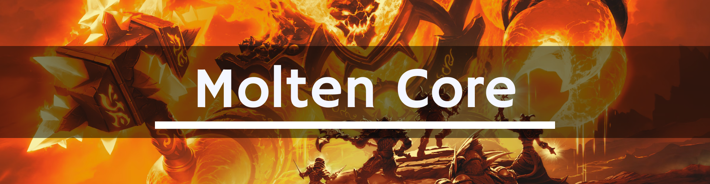

# 🔥 **[T-Guides] Molten Core**

### ⚠️ ВАЖНО: Данный гайд адаптирован под рейд ростер который ведет РЛ Titanbeard (гильдия O N L I N E). Вы можете использовать его как основу для создания своего собственного гайда.

## 🛡️ **Роли танков**

  * **Мейн-танк (МТ) Паладин:** `Titanbeard`
  * **Офф-танк (ОТ) Друид:** `Misha`

## 🧪 **Расходники**

  * **[Greater Fire Protection Potion (ГФПП)](https://database.turtle-wow.org/?item=13457)**: Основной расходник. Нужно много.
  * **[Greater Arcane Protection Potion (ГАПП)](https://database.turtle-wow.org/?item=13461)**: Для **Shazzrah** и **Thaurissan**.
  * **[Restorative Potion](https://database.turtle-wow.org/?item=9030)**: Обязательно на **Lucifron**.
  * **[Limited Invulnerability Potion (LIP)](https://database.turtle-wow.org/?item=3387)**: Для фазы 50% на **Golemagg**.
  * Вся остальная **минимальная химия** пьется по умолчанию. Список можно посмотреть **[здесь](https://docs.google.com/spreadsheets/d/1F4txPb-2qzuf0FMHRqRDPYN3_nVGPMNQDlKYYwzOBDA/edit?gid=0#gid=0)**.
  * Наличие боссмода **[BigWigs](https://github.com/pepopo978/BigWigs)** обязательно для каждого уважающего себя рейдера.
  * Удобный аддон для снятия ядов, проклятий и остальных дебаффов - **[Rinse](https://github.com/Otari98/Rinse)**.

> 📝 **Примечание:** Препот химия пьется **до пула**, чтобы кулдаун успел откатиться во время боя для второго использования.

---

## 🗝️ **Доступ к Molten Core**

Для получения быстрого доступа в **Molten Core** необходимо выполнить квест **[Attunement to the Core - Horde](https://database.turtle-wow.org/?quest=7487)** / **[Attunement to the Core - Alliance](https://database.turtle-wow.org/?quest=7848)**.

* **1. Начало квеста:**
    * Квест берется у **[Lothos Riftwaker](https://database.turtle-wow.org/?npc=14387)** (начинать можно с 55-го уровня) на нижнем уровне **Blackrock Mountain**.

* **2. Core Fragment:**
    * Квест требует добыть **[Core Fragment](https://database.turtle-wow.org/?item=18412)** в подземелье **Blackrock Depths (BRD)**.
    * Фрагмент находится в самой глубине, у перехода к **Emperor Dagran Thaurissan**.

* **3. Путь через Lava Run:**
    * Самый быстрый путь к фрагменту - через так называемый **"Lava Run"**: спрыгнуть с балкона у **Lord Incendius** в лаву, обходить по левому краю, пока не дойдешь до моста.
    * Потребуется химия (**[Greater Fire Protection Potion](https://database.turtle-wow.org/?item=13457)**) или хилл, чтобы пережить плавание через лаву.

* **4. Завершение:**
    * После сбора **Core Fragment** вернитесь к **Lothos Riftwaker** и сдайте квест.
    * Это активирует портал, позволяющий использовать **Lothos Riftwaker** для **телепортации** прямо в **Molten Core**.

---

## 🔥 **1. Incindis**

  * **Препот:** **[Greater Fire Protection Potion](https://database.turtle-wow.org/?item=13457)**.

  * **Тактика:**

    1.  Ждем, пока МТ развернет босса **боком к рейду**. После этого начинаем атаку.
    2.  **После притяжки к боссу - немедленно убегаем!** Иначе получите огромный урон от **[Fire Nova](https://database.turtle-wow.org/?spell=42037)**.
    3.  Как только появляются **яйца** - мгновенно переключаемся и убиваем их. ОТ подхватывает вылупившихся аддов, кливаем их под боссом.
    4.  После второй притяжки **перепейте ГФПП**, если действие предыдущего закончилось.

---

## 😈 **2. Lucifron**

  * **Препот:** **[Greater Fire Protection Potion](https://database.turtle-wow.org/?item=13457)**.

  * **Тактика:**

    1.  Через **10 секунд** после начала боя выпейте **[Restorative Potion](https://database.turtle-wow.org/?item=9030)** для снятия дебаффа - **[Lucifron's Curse](https://database.turtle-wow.org/?spell=19703)**.
    2. Во время боя диспелить магический дебафф **[Impending Doom](https://database.turtle-wow.org/?spell=19702)**
    3.  **Маги** должны **шипать** (Polymorph) игроков, находящихся под действием контроля **[Dominate Mind](https://database.turtle-wow.org/?spell=7645)**. **Паладины** могут использовать **Stun** (Оглушение).
    4.  **Приоритет убийства:** Сначала фокусируемся на **боссе**, затем равномерно убиваем **двух аддов**.

---

## 🐕 **3. Magmadar**

  * **Препот:** **[Greater Fire Protection Potion](https://database.turtle-wow.org/?item=13457)**.

  * **Тактика:**

    1.  Босса ведем вдоль **левой стены**.
    2.  На МТ должен быть **антифир** бафф чтобы заклинание босса **[Panic](https://database.turtle-wow.org/?spell=19408)** не зафиряло МТ.
    3.  **Смотрите под ноги!** Выходите из огненных луж.
    4.  **Перепивайте ГФПП**, как только спадет кулдаун.
    5.  **Охотники** должны снимать бафф **[Frenzy](https://database.turtle-wow.org/?spell=28371)** (Безумие) с босса своим скиллом **[Tranquilizing Shot](https://database.turtle-wow.org/?spell=19801)**.
    6.  **Важно для хилов:** Продолжайте лечить рейд даже после смерти босса (из-за ДОТки **[Conflagration](https://database.turtle-wow.org/?spell=16805)**).

---

## 🌋 **4. Golemagg the Incinerator**

  * **Препот:** **[Greater Fire Protection Potion](https://database.turtle-wow.org/?item=13457)**.

  * **Тактика:**

    1.  Вкладываемся в **максимальный ДПС** по боссу.
    2.  На **50% HP** его собаки-адды срываются с ОТ и атакуют рейд.
    3.  В этот момент **ВСЕ** пьют **[Limited Invulnerability Potion](https://database.turtle-wow.org/?item=3387)**.
    4.  Используйте **способности для выживания**, чтобы собаки вас не убили.
    5.  **НЕ УБЕГАЙТЕ!** Если вы побежите от ОТ, то он не сможет их снова подхватить.
    6.  МДД не набирайте много стаков **[Magma Splash](https://database.turtle-wow.org/?spell=13880)**. Отходите от босса чтобы сбросить дебафф.
    7.  **Важно для хилов:** Продолжайте лечить после смерти босса.

---

## 👯 **5. Twin Golems**

  * **Препот:** **[Greater Fire Protection Potion](https://database.turtle-wow.org/?item=13457)**.

  * **Тактика:**

      * Все просто: бьем того голема, на метку которого **дают анонс**, потому что другой голем будет иметь бафф **[Molten Bulwark](https://database.turtle-wow.org/?spell=47375)** снижающий весь входящий урон на **95%** и наносящий вам в ответ огненный урон.

---

## 👑 **6. Sorcerer-Thane Thaurissan**

  * **Препот:** **[Greater Arcane Protection Potion](https://database.turtle-wow.org/?item=13461)**.

  * **Способности:**

      * **[Rune of Power](https://database.turtle-wow.org/?spell=52724) (Усиливающая руна):** Босс создает на полу руну, которая **усиливает урон** всех стоящих в ней, включая босса.
      * **Cone Cleave:** Конусный урон перед собой.
      * **[Rune of Detonation](https://database.turtle-wow.org/?spell=52726) (Руна взрыва):** Босс вешает на игроков дебафф, по истечении времени (6 сек.) которого они **взрываются**, нанося урон всем вокруг себя.
      * **[Rune of Combustion](https://database.turtle-wow.org/?spell=52725) (Руна возгорания):** Босс вешает на игроков дебафф, по истечении времени (6 сек.) которого они **взрываются**, нанося огромный урон всем вокруг себя.

  * **Тактика:**

    1.  **Позиционирование с руной:**
          * **Рейд** стоит **ВНУТРИ** руны для баффа на урон.
          * **Босса** держат **СНАРУЖИ**, иначе он тоже получит бафф!
    2.  Рейд **ВСЕГДА** стоит за спиной босса.
    3.  **Дебаффы:**
          * **Руна взрыва - "Разбежаться":** Все должны максимально **рассеяться по комнате**. Рядом с вами не **должны** находиться другие игроки.
          * **Руна возгорания - "Сбежаться":** Весь рейд должен быстро собраться в кучу **внутри руны**, чтобы разделить урон. Игрок не вбежавший в рейд **может его вайпнуть!**
    4.  **Копия (на 50% HP):** Появляется неубиваемая копия босса. ОТ забирает ее и отводит в сторону. Рейд фокусирует основного босса.
    5.  **Смена руны:** На 50% HP руна (Rune of Power) меняет положение. Если скоро механика (сбежаться/разбежаться), лучше **притормозить ДПС**, чтобы руна не переехала в неудачный момент.

---

## 🪨 **7. Garr**

  * **Тактика:**
    1.  **ОТ** берет **босса**.
    2.  **Все бойцы ближнего боя (милики)** бьют **только босса**. **Милики, НЕ ПОДХОДИТЕ к аддам!**
    3.  **МТ** забирает **всех аддов** и отводит их в сторону.
    4.  **Все РДД (ренжи/кастеры)** убивают аддов **по меткам**, которые объявляет МТ.
    5.  Хилы на МТ будут назначены голосом до боя.
    6. **ВАЖНО**: После боя с боссом нужно перебаффать рейд. Так как во время боя босс снимает рандомно баффы с игроков.

---

## 💣 **8. Baron Geddon**

  * **Препот:** **[Greater Fire Protection Potion](https://database.turtle-wow.org/?item=13457)**.

  * **Тактика:**

    1.  Ждем, пока МТ прочно заагрит босса. Обычно 3-5 секунд.
    2.  Бьем, но **сразу убегаем** от босса, когда объявляют соответствующую способность (**[Inferno](https://database.turtle-wow.org/?spell=19695)**).
    3.  Игрок со **"Смертельной бомбой" ([Living Bomb](https://database.turtle-wow.org/?spell=20475))** должен **немедленно вынести ее из рейда**.
    4.  **Вторую бомбу нельзя нести туда, где взорвалась первая!**
    5.  По возможности **перепивайте ГФПП**.
    6.  Все, кто может, **диспелят** магический дебафф **[Ignite Mana](https://database.turtle-wow.org/?spell=19659)** с хилов.

---

## 🌌 **9. Shazzrah**

  * **Препот:** **[Greater Arcane Protection Potion](https://database.turtle-wow.org/?item=13461)**.

  * **Тактика:**

    1.  Заходим на босса "с двух ног" и вкладываем **максимальный ДПС**.
    2.  **Обязательно перепейте ГАПП, когда у босса останется \~40% HP**, иначе высокий риск смерти от тайной магии потому что на вас висит дебафф от босса **[Shazzrah's Curse](https://database.turtle-wow.org/?spell=19713)** увеличивающий весь магический урон по вам на 100%.
    3. ОТ стоит в РДД зоне и ловит босса если тот использует **[Blink](https://database.turtle-wow.org/?spell=14514)** (Телепортируется).

---

## 🕯️ **10. Sulfuron Harbinger**

  * **Препот:** **[Greater Fire Protection Potion](https://database.turtle-wow.org/?item=13457)**.

  * **Тактика:**

    1.  **ОТ** забирает **босса** и отводит от аддов чтобы они не получили бафф **[Inspire](https://database.turtle-wow.org/?spell=19779)**.
    2.  **МТ** забирает **аддов**.
    3.  **Назначенные игроки** сбивают касты **[Dark Mending](https://database.turtle-wow.org/?spell=19775)** аддам.
    4.  **Назначенный сборщик** собирает мелких аддов и подводит их к МТ.
    5.  **Порядок убийства:** Сначала убиваем **весь трэш и аддов**, потом добиваем **босса**.
    6. Во время убийства босса МДД игрокам можно выпить **[Free Action Potion](https://database.turtle-wow.org/?item=5634)** чтобы не поймать стан от способности босса **[Hand of Ragnaros](https://database.turtle-wow.org/?spell=19780)**

---

## 🤵 **11. Majordomo Executus**

  * **Препот:** **[Greater Fire Protection Potion](https://database.turtle-wow.org/?item=13457)**.

  * **Тактика:**

    1.  **Назначенные маги** **шипают** (Polymorph) данные им метки.
    2.  **ОТ** берет **босса**.
    3.  **МТ** и несколько **рейдеров** забирают **аддов**.
    4.  Убиваем всех по очереди, фокусируясь по **объявленным меткам**.

---

## 🔱 **12. Ragnaros**

> ⚠️ **ВАЖНО:** Пьем **[Greater Fire Protection Potion](https://database.turtle-wow.org/?item=13457)** ТОЛЬКО ПОСЛЕ НАЧАЛА ДИАЛОГА МАЖОРДОМА!

  * **Расстановка:**

      * **Все милики** стоят одним лагерем **за спиной босса**.
      * **Мана-юзеры (ренжи)** равномерно встают вокруг, **не более 2 человек в одном месте**.
      * **Хилы** распределяются по необходимости.

  * **Вторая фаза (Sons of Flame):**

    1.  **МТ** бежит **в мили-зону** и ловит аддов там.
    2.  **ОТ** ловит их **рядом с местом, где танчил босса**.
    3.  **Все, кого атакуют адды, бегут к этим точкам**, чтобы танки могли забрать мобов с вас.

---

## 🔗 Содержание

- [Главная страница](..) 
- [Полное содержание](../README.md)

---

### ✍️ **Участие и обратная связь**

Если ты заметил **ошибку**, неточность в описании или можешь что-то улучшить - не стесняйся! Смело создай **Issue**: [https://github.com/whtmst/T-Guides/issues](https://github.com/whtmst/T-Guides/issues).

---

## 📄 Лицензия

Лицензия [GPL-3.0 license](../LICENSE) - не стесняйтесь использовать эти данные в своих проектах!

---

## 👥 Автор

**Создано и/или поддерживается пользователем**: [Wht Mst](https://github.com/whtmst)

*Сделано с ❤️ для сообщества Turtle WoW*

*Этот проект не связан (или не аффилирован) с Turtle WoW или Blizzard Entertainment.*