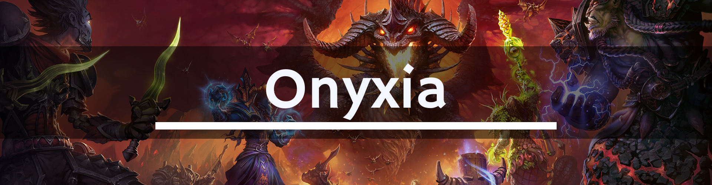

# 🐲 **[Turtle WoW] Onyxia's Lair**

## 🧪 **Расходники**

  * **[Greater Fire Protection Potion (ГФПП)](https://database.turtle-wow.org/?item=13457)**: Критически важный расходник. Нужно иметь минимум 3-5 штук. Поглощает урон от **Deep Breath** и **Fireball**.
  * **[Mighty Rage Potion](https://database.turtle-wow.org/?item=13442)**: Воинам для быстрого набора аггро после приземления (Фаза 3).
  * Вся остальная **минимальная химия** пьется по умолчанию. Список можно посмотреть **[здесь](https://docs.google.com/spreadsheets/d/1F4txPb-2qzuf0FMHRqRDPYN3_nVGPMNQDlKYYwzOBDA/edit?gid=0#gid=0)**.
  * Наличие боссмода **[BigWigs](https://github.com/pepopo978/BigWigs)** обязательно для каждого уважающего себя рейдера.
  * Удобный аддон для снятия ядов, проклятий и остальных дебаффов - **[Rinse](https://github.com/Otari98/Rinse)**.

---

## ⚔️ **Фаза 1: Наземная (100% - 65%)**

  * **Препот:** **[Greater Fire Protection Potion](https://database.turtle-wow.org/?item=13457)**.

  * **Способности:**
    * **[Wing Buffet](https://database.turtle-wow.org/?spell=18500) (Удар крылом):** Фронтальный конус. Наносит урон и отбрасывает. Игнорирует броню. Обычно снижает аггро.
    * **[Flame Breath](https://database.turtle-wow.org/?spell=18435) (Огненное дыхание):** Фронтальное АОЕ. Наносит значительный урон огнем.
    * **Cleave (Рассекающий удар):** Стандартный клив дракона.
    * **Tail Swipe (Удар хвостом):** Отбрасывает игроков, стоящих сзади, в яйца с дракончиками.

  * **Тактика:**
    1.  **МТ** вбегает первым и разворачивает Ониксию **спиной к дальней стене** (ровно по центру).
    2.  **Рейд** ждет команды на атаку, чтобы не сорвать аггро, пока МТ разворачивает и ставит босса.
    3.  **Позиционирование:**
        * **МТ:** Держит босса строго по центру энкаунтера у стены.
        * **МДД:** Бьют сбоку (между переднем и задней лапой, в заднюю лапу). **Строго запрещено** заходить за спину (хвост) или к голове.
        * **РДД и Хилы:** Стоят с боку.
    4.  **Важно:** Если **Wing Buffet** отбрасывает танка, он может потерять аггро потому что не бьет в этот момент. ДД должны следить за **[трит-метром](https://github.com/MarcelineVQ/TWThreat)** и стопать урон при необходимости.

---

## 🔥 **Фаза 2: Воздушная (65% - 40%)**

> ⚠️ **Триггер:** Ониксия взлетает со словами *"from above"* ("с небес").

  * **Способности:**
    * **[Deep Breath](https://database.turtle-wow.org/?spell=18584) (Глубокое дыхание):** Самая опасная способность. Ониксия делает глубокий вдох и сжигает широкую полосу арены. **Ваншот** для большинства классов. **BigWigs** предупредит: *"Deep Breath incoming!"*.
    * **[Fireball](https://database.turtle-wow.org/?spell=18392) (Огненный шар):** Кидает в случайных игроков. Наносит урон в радиусе при попадании. **BigWigs** ставит рейдовую метку (череп/крест) на цель; цель должна немедленно отойти от группы, чтобы не нанести урон союзникам.
    * **[Onyxian Whelps](https://database.turtle-wow.org/?npc=11262) (Дракончики):** Из боковых пещер (слева и справа) выбегают паки мелких драконов.

  * **Тактика:**
    1.  **Разбежаться!** Весь рейд должен максимально рассредоточиться (расстояние 5-10 метров друг от друга), чтобы **Fireball** не задевал соседей.
    2.  **Onyxian Whelps (Дракончики): - работа танков:**
        * Танки заранее распределяют стороны.
        * **МТ** забирает пак с одной стороны (например, правой).
        * **ОТ** забирает пак с другой стороны (например, левой).
        * Задача танков - собрать их в плотную кучу под АОЕ урон игроков.
    3.  **ДПС по боссу:** РДД продолжают бить босса в воздухе.
    4.  **Deep Breath (Глубокое дыхание):**
        * Следите за эмоцией в чате: *"Onyxia takes in a deep breath..."* или предупреждением **BigWigs**.
        * Посмотрите, куда направлена Ониксия.
        * **Бегите к стенам!** (Либо к той стене, откуда она летит, либо максимально к краям, избегая центральной линии полета).
    5.  Доведите босса до **40% HP**, чтобы перевести в 3-ю фазу.

---

## 💀 **Фаза 3: Страх и Хаос (40% - 0%)**

> ⚠️ **Триггер:** Ониксия приземляется со словами *"It seems you'll need another lesson"* ("Похоже, вам нужен еще один урок").

  * **Способности:**
    * **Все способности Фазы 1** (**Wing Buffet**, **Flame Breath**, **Cleave**, **Tail Swipe**) возвращаются.
    * **[Bellowing Roar](https://database.turtle-wow.org/?spell=18431) (Ужасающий рев):** Массовый страх (Fear) на весь рейд. **BigWigs** предупредит: *"Fear soon!"* и *"Fear"*.
    * **Lava Eruption:** Из трещин в полу вырывается лава, нанося урон (периодически).

  * **Тактика:**
    1.  **СТОП ДПС!** При переходе фазы (когда она начинает снижаться) **ВСЕ** прекращают атаку. Дайте танку время снова набрать аггро и поставить босса в правильное положение.
    2.  **Позиционирование:** МТ ловит босса и снова ставит к стене. Рейд занимает позиции как в **Фазе 1**.
    3.  **Борьба со страхом (Bellowing Roar):**
        * **Хилы/Саппорты:** Жрецы вешают **Fear Ward** на МТ (и на ОТ, если есть возможность). Шаманы ставят **Tremor Totem**.
        * **Смена танков (если нет Fear Ward или Tremor Totem):** Когда **МТ ловит фир** и босс разворачивается в рейд, **ОТ** забирает ее на себя и ставит к стене, пока МТ возвращается.
    4.  **Выживание:** Перепейте **ГФПП**, если действие закончилось. Хилы должны держать обоих танков на фул хп перед каждым дыханием или страхом.
    5.  Добиваем босса.

---

## 🔗 Содержание

- [Главная страница](..) 
- [Полное содержание](../README.md)

---

### ✍️ **Участие и обратная связь**

Если ты заметил **ошибку**, неточность в тактике или можешь что-то улучшить - не стесняйся! Смело создай **Issue**: [https://github.com/whtmst/T-Guides/issues](https://github.com/whtmst/T-Guides/issues).

---

## 📄 Лицензия

Лицензия [GPL-3.0 license](../LICENSE) - не стесняйтесь использовать эти данные в своих проектах!

---

## 👥 Автор

**Создано и/или поддерживается пользователем**: [Wht Mst](https://github.com/whtmst)

*Сделано с ❤️ для сообщества Turtle WoW*

*Этот проект не связан (или не аффилирован) с Turtle WoW или Blizzard Entertainment.*